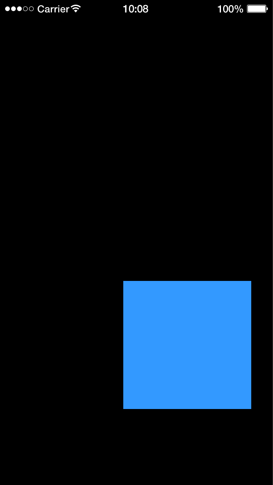

# dmc-multitouch

Move, scale and rotate for Solar2D (formerly Corona SDK): let the user drag a display object with one finger, and move, pinch and turn it with two.

```lua
local MultiTouch = require 'dmc_corona.dmc_multitouch'

MultiTouch.activate( photo, 'move', { 'single', 'multi' } )
MultiTouch.activate( photo, 'scale', 'multi', { minScale=0.5, maxScale=3 } )
MultiTouch.activate( photo, 'rotate', 'multi' )
```

## Features

- Three actions, move, scale and rotate, each worked by one finger, two fingers or both; layer them on one object to mix and match
- Limits for each: bounds and a fixed angle for move, a smallest and largest scale, a smallest and largest rotation
- Rotation through any number of turns, either way
- An event for each step of the gesture, with the position, how far it has moved and turned, and which way
- Touches that begin on the object stay with it when they move off it, through [dmc-touchmanager](https://github.com/dmccuskey/dmc-touchmanager), which also turns on multitouch
- Pure Lua, no plugins needed; MIT licensed

## Quick Start

The following code will get you up and running in about 10 minutes in the Solar2D Simulator on macOS or Windows. It makes a square that you drag with one finger, and move, pinch and turn with two.

Prerequisites: the [Solar2D](https://solar2d.com/) Simulator and a copy of this repository (`git clone https://github.com/dmccuskey/dmc-multitouch.git`, or download the ZIP from GitHub). The Simulator has one touch, the mouse, so in it you can only drag; to pinch and turn, build to a device.

### 1. Copy the Library into Your Project

Copy these from this repository into the root of your project folder:

```text
dmc_corona_boot.lua     loader for the DMC libraries
dmc_corona.cfg          configuration
dmc_corona/             dmc-multitouch and dmc-touchmanager
```

**Going further:** keep the libraries in a subfolder, or combine several DMC libraries ([dmc-corona-boot Configuration](https://github.com/dmccuskey/dmc-corona-boot/blob/master/docs/configuration.md)).

### 2. A Square to Drag, Pinch and Turn

Create `main.lua` in the project folder:

```lua
local MultiTouch = require 'dmc_corona.dmc_multitouch'

local square = display.newRect( display.contentCenterX, display.contentCenterY, 150, 150 )
square:setFillColor( 0.2, 0.6, 1 )

-- one finger drags it; two fingers move, pinch and turn it
MultiTouch.activate( square, 'move', { 'single', 'multi' } )
MultiTouch.activate( square, 'scale', 'multi', { minScale=0.5, maxScale=3 } )
MultiTouch.activate( square, 'rotate', 'multi' )

square:addEventListener( MultiTouch.MULTITOUCH_EVENT, function( event )
	print( 'multitouch', event.phase, math.floor( event.x ), math.floor( event.y ) )
end )
```

Open the project in the Simulator and drag the square down and to the right: it follows the mouse, and the console shows lines like these:

```text
WARNING: Simulator does not support multitouch events
multitouch	began	160	240
multitouch	moved	166	252
multitouch	moved	172	264
...
multitouch	ended	220	360
```



The warning comes from Solar2D when dmc-touchmanager turns multitouch on; a device doesn't print it. On a device, put two fingers on the square and spread them apart while turning them: the square grows, up to three times its size, and turns with them.

If the console shows `module 'dmc_corona.dmc_multitouch' not found` instead, `dmc_corona/` is missing from the root of the project folder. Require it by that full name: `require 'dmc_multitouch'` fails, because the loader that finds the DMC libraries runs only once dmc-multitouch is loading.

**Going further:** the limits for each action and the event fields are under [API](#api); the [example](examples/README.md) is the Quick Start's square.

To update, copy `dmc_corona_boot.lua` and `dmc_corona/` again from the newer version. Keep your own `dmc_corona.cfg` if you have changed it.

## API

```lua
local MultiTouch = require 'dmc_corona.dmc_multitouch'
```

`MultiTouch.VERSION` is the version. Positions are in the object's parent's coordinates; angles are in degrees, clockwise, as for `rotation`, except `constrainAngle`.

### MultiTouch.activate( obj, action, touch [, params] )

Adds one action to `obj`, a display object; call it once for each action. Returns `obj`. An unknown `action` raises an error, such as `dmc_multitouch: unknown action 'spin', use 'move', 'scale' or 'rotate'`.

| argument | | |
|---|---|---|
| `action` | `'move'`, `'scale'` or `'rotate'` | what the touch does to the object |
| `touch` | `'single'`, `'multi'`, or `{ 'single', 'multi' }` | worked by one finger, by two, or by either |
| `params` | table, optional | the limits for the action, below |

With two fingers, the object moves with their midpoint, scales with the distance between them, and turns as the line between them turns. With one finger, scale and rotate work around the object's centre: the finger's distance from the centre scales it, and circling the centre turns it.

**Move** (`'move'`):

| key | type | |
|---|---|---|
| `xBounds` | table `{ min, max }` | the range for the object's `x`; either may be `nil` for no limit |
| `yBounds` | table `{ min, max }` | the range for the object's `y` |
| `constrainAngle` | number, 0 to 180 | move only along a line through where the object started, at this angle counter-clockwise from across: 0 is across, 45 up and to the right, 90 up and down (unlike `rotation`). With it, only one of the bounds applies: `xBounds` if given, else `yBounds` |

**Scale** (`'scale'`): `minScale` and `maxScale`, numbers, the limits for `xScale` and `yScale` (always set together).

**Rotate** (`'rotate'`): `minAngle` and `maxAngle`, numbers, the limits for `rotation`; either can be negative.

**Which actions go together.** One finger can't both move the object and scale or rotate it: adding single-touch scale or rotate to an object with single-touch move, or the other way round, prints `ERROR: '<action>' is not compatible with the current config` and leaves the action out. Every other combination works, such as one-finger move with two-finger scale and rotate (the Quick Start), or one-finger rotate with two-finger move.

Calling `activate()` again for an action replaces its settings.

### MultiTouch.deactivate( obj )

Removes every action from `obj`; it no longer responds to touches. It does nothing for an object that was never activated. Removing the object (`obj:removeSelf()`) needs no `deactivate()` first.

### The Event

`obj` sends `MultiTouch.MULTITOUCH_EVENT` (`'multitouch_event'`) at each step of the gesture; listen with `obj:addEventListener( MultiTouch.MULTITOUCH_EVENT, listener )`. The fields:

| field | |
|---|---|
| `name` | `'multitouch_event'` |
| `phase` | `'began'`, `'moved'`, `'ended'` or `'canceled'`, from the touch that caused it |
| `target` | the object |
| `x`, `y` | where the gesture puts the object, before `xBounds` and `yBounds` |
| `xDelta`, `yDelta` | how far that is from where the object was when the gesture began |
| `angleDelta` | how far the gesture has turned since it began, clockwise |
| `direction` | `'clockwise'` or `'counter_clockwise'`: which way it last turned; `nil` before it turns |
| `distanceDelta` | how far that is, in a straight line |

A gesture begins (`began`) when the first finger touches an object with a single-touch action, and again when a second finger joins for a multi-touch action. Lifting one of two fingers sends `ended` for it; the other finger carries on a single-touch action without another `began`.

## Configuration

dmc-multitouch has no settings: there is no `[DMC_MULTITOUCH]` section in `dmc_corona.cfg`. The file needs only the `[DMC_CORONA]` section, which tells the loader where the libraries are ([dmc-corona-boot Configuration](https://github.com/dmccuskey/dmc-corona-boot/blob/master/docs/configuration.md)).

## Known Issues

None known. The changes in each version are in the [CHANGELOG](CHANGELOG.md).

## Development

Only `dmc_corona/dmc_multitouch.lua` is written in this repository, along with the example's own files (`main.lua`, `config.lua`, `build.settings`). It uses [dmc-touchmanager](https://github.com/dmccuskey/dmc-touchmanager). `dmc_corona/dmc_touchmanager.lua`, `dmc_corona_boot.lua`, and the copies in the example are generated by Snakemake from sibling checkouts (`../dmc-touchmanager`, `../dmc-corona-boot`, `../DMC-Corona-Library` for the shared rules); fix the source, then rebuild. [DMC-Corona-Library](https://github.com/dmccuskey/DMC-Corona-Library) bundles dmc-multitouch: after a change here, rebuild it. From this repository's root folder:

```sh
snakemake --cores 1 build_all
```

The unit tests run in plain Lua 5.1, with a stand-in for the Touch Manager:

```sh
tests/run_unit.sh
```

They need Lua 5.1 and dkjson; `LUA=` names the interpreter. The Quick Start and the example are the check that it works in Solar2D.

## License

dmc-multitouch is released under the [MIT License](LICENSE).
