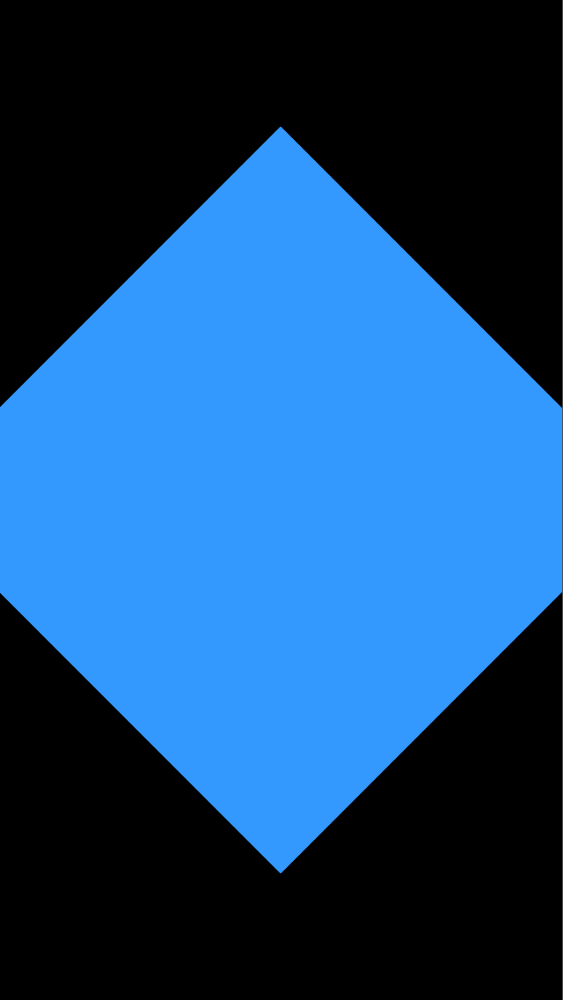

# Examples

Each folder is a complete Solar2D project with its own copy of the library: open its `main.lua` in the Solar2D Simulator.

| | |
|---|---|
|  | **dmc-multitouch-basic**: a blue square to drag with one finger, and move, pinch (from half to three times its size) and turn with two; the console shows each event's phase, position and direction. In the Simulator the mouse can only drag it; the screenshot is after two fingers, scripted, spread to twice their distance while turning 45°. |
